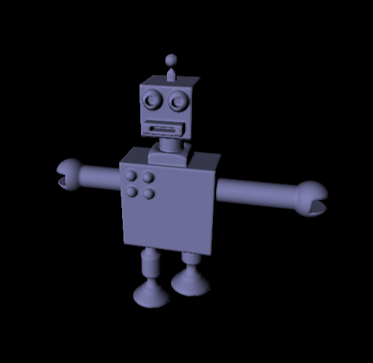

# HW 6: Ray marching and SDFs

I used ray-marching and sine distance fields to create an animated robot. The final project can be found at https://tabathah.github.io/Project6-RayMarching-Implicit-Surfaces. Here are some pictures of the final product:

 

For every fragment in the scene, I cast a ray from the camera position to the fragment. I then march down this ray, evaluating how far I should I march by the closest value based on sine distance fields of the objects in my scene, until I reach a sine distance field value less than a certain epsilon value. 

I implemented the following primitive shapes and operators for sine distance fields, using IQ's SDF notes (http://iquilezles.org/www/articles/distfunctions/distfunctions.htm) as a reference.

I wrote SDF methods for Sphere, Box, Cone, Cylinder, and Torus. I also wrote operators, union, intersection, and subtraction, to combine them. I also wrote a function that took in a point and a matrix that included translation and rotation (scale was dealt with manually in the parameters of the SDFs), and applied the inverse of these transformations on the point to put it in world space, rather than local object space.

I also wrote a function to compute the normal of the point using the SDFs, and computed a simple Lambertian shader. 

To animate my robot, I passed time in as a uniform, and translated the neck/head, the arms, and the legs based on the time value.

The program runs very slow right now. I created bounding volumes to optimize the SDF computing, but this didn't seem to do much. I suspect the problem is in my ray casting, as I was having trouble doing camera computations in the CPU, so I do them in the GPU. I hope to fix this in the near future.  